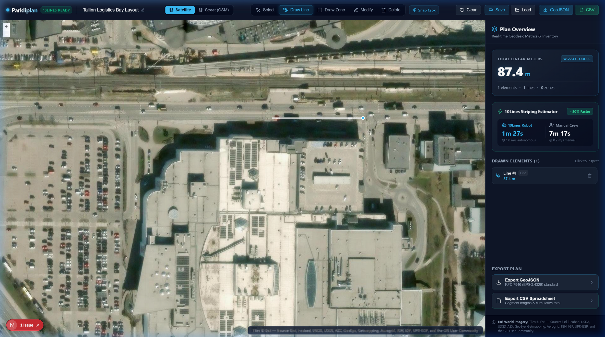

# Parkliplan

**Interactive Geospatial Planning & Measurement Engine for Autonomous Pavement Striping**

[](LICENSE)
[](https://nextjs.org/)
[](https://fastapi.tiangolo.com/)
[](https://openlayers.org/)
[](https://www.typescriptlang.org/)
[](https://www.docker.com/)

---

## Table of Contents

- [Overview](#overview)
- [Core Capabilities](#core-capabilities)
- [Mathematical Accuracy & Latitude Correction](#mathematical-accuracy--latitude-correction)
- [Quick Start](#quick-start)
- [Keyboard Navigation](#keyboard-navigation)
- [Architecture & Repository Structure](#architecture--repository-structure)
- [Engineering Documentation](#engineering-documentation)
- [Automated Verification Suite](#automated-verification-suite)
- [REST API Reference](#rest-api-reference)
- [Author & License](#author--license)
- [Legal, Attributions & Disclaimers](#legal-attributions--disclaimers)

---

## Overview

Autonomous pavement striping robots (such as those pioneered by **10Lines OÜ**) replace manual chalking and tape measurement with autonomous, electric precision marking. However, autonomous field deployments require exact, machine-readable geospatial layouts generated over real-world asphalt coordinates.

**Parkliplan** is a lightweight, web-native spatial layout editor engineered for striping contractors, estimators, and robotic fleet planners. It allows operators to design stall lines, safety bays, and boundaries directly over high-resolution aerial imagery, calculate distortion-free linear metrics, and export compliant geometries for robotic trajectory planners.


*Live preview of the Parkliplan canvas: high-resolution Esri aerial imagery, real-time WGS84 geodesic metrology (`87.4 m`), and 10Lines autonomous striping duration estimator.*

---

## Core Capabilities

- **Dual-Layer Basemap Synchronization**: Instant, zero-reload switching between sub-meter resolution **Esri World Imagery** and cartographic **OpenStreetMap**, allowing operators to match layout boundaries directly with asphalt joints and curbs.
- **Topological Snapping & Editing**: Interactive vector drawing with a calibrated **12-pixel magnetic capture radius** (`ol/interaction/Snap`) for vertices and edges, accompanied by vertex manipulation (`ol/interaction/Modify`) and interactive deletion.
- **WGS84 Geodesic Metrology**: Pavement distances are computed over the **WGS84 Earth ellipsoid** (`ol/sphere.getLength`), canceling out Web Mercator projection distortion ($\approx 1.96\times$ distance exaggeration at northern latitudes such as Tallinn, Estonia at 59.4° N).
- **10Lines Execution Estimator**: Real-time operational metric translating linear meterage into execution duration, comparing autonomous robotic striping (~1.0 m/s) against conventional manual crews (~0.2 m/s).
- **Dual Export Pipeline**:
  - **GeoJSON (RFC 7946)**: Coordinate projection in `EPSG:4326` (WGS84 `[longitude, latitude]`) with full feature metadata, ready for ingestion by GIS software (QGIS, ArcGIS) and autonomous path planning pipelines.
  - **Tabular CSV**: Formatted report listing individual element types, segment lengths, and the cumulative project total for cost estimation.
- **State Persistence**: Full plan lifecycle management (`Create`, `Read`, `List`, `Delete`) backed by an asynchronous SQLite database through a typed FastAPI REST interface.

---

## Mathematical Accuracy & Latitude Correction

Standard web map interfaces render spatial features in **Spherical Mercator (EPSG:3857)**. While Mercator preserves angles locally, it introduces significant areal and linear distortion as latitude increases:

$$k = \frac{1}{\cos(\phi)}$$

Where:
- $\phi$ is the site latitude.
- $k$ is the linear scale inflation factor.

At the latitude of Tallinn, Estonia ($\phi \approx 59.437^\circ\text{ N}$):

$$k = \frac{1}{\cos(59.437^\circ)} \approx 1.964$$

A standard 5.0-meter parking stall line naively measured in Cartesian Web Mercator coordinates results in $\approx 9.82$ units—an error of **+96.4%**. 

Parkliplan mitigates this distortion entirely by calculating all lengths and perimeters via great-circle ellipsoidal integration (`ol/sphere.getLength`), providing sub-centimeter physical accuracy required for autonomous vehicle navigation.

---

## Quick Start

### Prerequisites

- [Docker](https://docs.docker.com/get-docker/) & Docker Compose
- Or Node.js 18+ and Python 3.11+ for local development without containers.

### Containerized Execution (Recommended)

Run the entire full-stack application with a single command:

```bash
docker compose up --build
```

| Service | Port | Endpoint |
|:---|:---|:---|
| **Frontend Web Client** | `3000` | [http://localhost:3000](http://localhost:3000) |
| **Backend API Service** | `8000` | [http://localhost:8000](http://localhost:8000) |
| **Interactive API Docs (Swagger)** | `8000` | [http://localhost:8000/docs](http://localhost:8000/docs) |
| **Service Healthcheck** | `8000` | [http://localhost:8000/health](http://localhost:8000/health) |

---

## Keyboard Navigation

To accelerate spatial drawing on site, Parkliplan supports single-key tool activation:

| Key | Mode | Operational Purpose |
|:---:|:---|:---|
| `L` | **Draw Line** | Plot line segments for parking stalls, lane lines, and stop bars (`LineString`). |
| `P` | **Draw Zone** | Demarcate parking bays, hatched areas, and pedestrian zones (`Polygon`). |
| `M` | **Modify** | Select, drag, and adjust existing vertices with snapping enabled. |
| `S` | **Select** | Inspect element properties, lengths, and highlight corresponding inventory items. |
| `D` | **Delete** | Click directly on any drawn geometry on the canvas to remove it. |

---

## Architecture & Repository Structure

```
parkliplan/
├── frontend/                     # Next.js 15 App Router & React 19 Client
│   ├── src/
│   │   ├── app/
│   │   │   ├── layout.tsx        # Document metadata and root layout
│   │   │   ├── page.tsx          # Application shell, hotkeys, and view composition
│   │   │   └── globals.css       # Design system, glassmorphism tokens, and layout styles
│   │   ├── components/
│   │   │   ├── MapView.tsx       # OpenLayers map canvas, layers, draw, modify & snap
│   │   │   ├── Toolbar.tsx       # Tool selection, basemap switch, persistence & exports
│   │   │   ├── SidePanel.tsx     # Geodesic metrics, 10Lines estimator & element list
│   │   │   └── LoadPlanModal.tsx # Plan retrieval modal connected to SQLite API
│   │   ├── context/
│   │   │   └── PlannerContext.tsx# Centralized state machine syncing OpenLayers with React
│   │   ├── types/
│   │   │   └── planner.ts        # TypeScript contracts for plans, tools, and GeoJSON
│   │   └── utils/
│   │       ├── api.ts            # Typed HTTP client for FastAPI endpoints
│   │       ├── export.ts         # RFC 7946 GeoJSON and CSV file generator
│   │       └── metrics.ts        # Spherical geodesic calculations (ol/sphere)
│   └── tests/                    # Vitest unit and precision test suite
│
├── backend/                      # FastAPI Python Application
│   ├── app/
│   │   ├── main.py               # ASGI application, CORS middleware, and REST routes
│   │   ├── models.py             # Pydantic v2 schemas for RFC 7946 GeoJSON validation
│   │   └── database.py           # aiosqlite asynchronous SQLite data access layer
│   └── tests/                    # pytest integration and validation test suite
│
├── docker-compose.yml            # Multi-container service definitions
├── LICENSE                       # MIT License
└── README.md                     # Engineering documentation
```

---

## Engineering Documentation

Detailed technical design notes and data contracts are documented in the [`docs/`](docs/) directory:

- [**`docs/GEODESICS.md`**](docs/GEODESICS.md): In-depth physical derivation of Web Mercator distortion ($k = \sec\phi$), comparison table across European/Nordic latitudes, and WGS84 great-circle spherical integration implementation.
- [**`docs/ROBOTIC_SPEC.md`**](docs/ROBOTIC_SPEC.md): Autonomous striping robot trajectory planning specification, RFC 7946 GeoJSON schema, RTK-GNSS local frame projection (ENU), and nozzle synchronization protocols.
- [**`docs/screenshots/`**](docs/screenshots/): Full-resolution visual test scans of the live interface and metrology readouts.

---

## Automated Verification Suite

Parkliplan maintains automated verification covering both frontend spatial math and backend data integrity.

### 1. Frontend Unit & Precision Tests (Vitest)

```bash
cd frontend
npm test
```

- **Geodesic Precision**: Validates that a 5.00-meter segment at latitude 59.437° N (Tallinn) measures $5.00 \pm 0.05\text{ m}$, verifying immunity to Mercator scale inflation.
- **CSV Serialization**: Confirms tabular output formatting, header integrity, individual lengths, and cumulative totals.
- **RFC 7946 Compliance**: Asserts property preservation, coordinate projection, and GeoJSON schema correctness.

### 2. Backend REST & Validation Tests (pytest)

```bash
cd backend
py -m pytest
```

- **Healthcheck**: Confirms service readiness and JSON payload schema.
- **GeoJSON Validation**: Verifies `POST /api/plans` persists valid collections and returns aggregated metrics.
- **Error Handling**: Verifies strict rejection of malformed or invalid geometry types with **HTTP 422 Unprocessable Entity**.
- **CRUD Operations**: Tests plan listing, retrieval by identifier, and clean deletion.

---

## REST API Reference

| Method | Route | Request Body | Response | Description |
|:---|:---|:---|:---:|:---|
| `GET` | `/health` | _None_ | `200 OK` | Verifies backend process availability. |
| `POST` | `/api/plans` | `PlanCreateRequest` | `201 Created` | Persists a new layout with validated GeoJSON. |
| `GET` | `/api/plans` | _None_ | `200 OK` | Lists summary metadata for all saved plans. |
| `GET` | `/api/plans/{id}` | _None_ | `200 OK` | Returns full RFC 7946 GeoJSON FeatureCollection. |
| `DELETE` | `/api/plans/{id}` | _None_ | `200 OK` | Permanently deletes a saved plan by its identifier. |

---

## Author & License

- **Author**: [@komythomas](https://github.com/komythomas)
- **License**: Released under the terms of the [MIT License](LICENSE). Copyright © 2026 komythomas.

---

## Legal, Attributions & Disclaimers

### Data & Basemap Attributions
- **Esri World Imagery**: Tiles © Esri — Source: Esri, i-cubed, USDA, USGS, AEX, GeoEye, Getmapping, Aerogrid, IGN, IGP, UPR-EGP, and the GIS User Community.
- **OpenStreetMap**: © [OpenStreetMap](https://www.openstreetmap.org/copyright) contributors.

### Trademark & Fair Use Notice
- **10Lines** is a registered trademark of 10Lines OÜ. All product names, trademarks, and registered trademarks cited in this repository are the property of their respective owners.
- Parkliplan is an independent technical demonstration and portfolio project developed by [@komythomas](https://github.com/komythomas) to demonstrate web-GIS spatial planning, geodesic calculation engines, and autonomous striping path generation.
- This software is not an official product of, nor is it endorsed by, affiliated with, or sponsored by 10Lines OÜ or the Norway Grants Green ICT programme.
